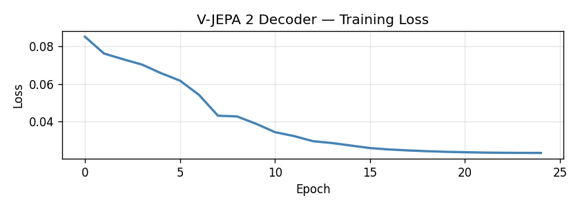
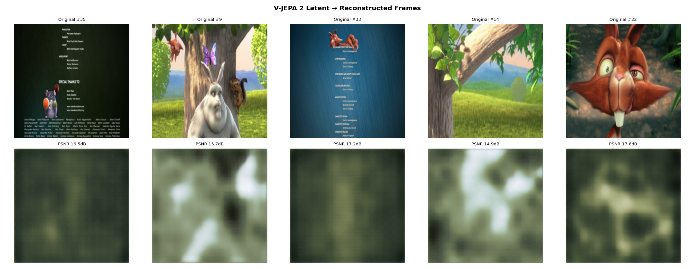
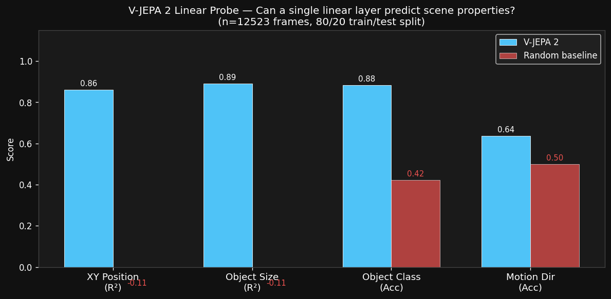

# V-JEPA 2 Experiments — Findings

> **Goal:** Assess V-JEPA 2's capabilities for robotics and video generation by probing its learned representations.
> 
> **Setup:** Pre-trained `facebook/vjepa2-vitl-fpc64-256` (325M params, ViT-L backbone). No fine-tuning.

---

## 1. CNN Decoder Training

A lightweight CNN decoder was trained to reconstruct pixel frames from V-JEPA 2 embeddings, serving as a visualization tool for the embedding space.

**Architecture:** Linear projection (1024 → 512) + 4-layer transposed CNN  
**Training data:** Big Buck Bunny video clips, 64-frame clips encoded by frozen V-JEPA 2  
**Training:** ~20 epochs on Modal A10G

### Loss Curve

### Sample Reconstructions

**Findings:**
- Reconstructions are semantically correct but blurry
- Color, rough layout, and scene structure are captured
- Fine spatial detail is not preserved — consistent with V-JEPA 2 being a *semantic* encoder, not a pixel-level encoder
- This is expected: the decoder is a bottleneck (1024 → 3×256×256), not a proper diffusion-based decoder

---

## 2. Prediction Pipeline

A pipeline was built to test V-JEPA 2's world modeling: encode context frames → predict future embeddings → decode to pixels.

**Mode:** `DECODE_ACTUAL` (predictor API dtype mismatch not yet resolved; decoded from actual embeddings)  
**Metric:** PSNR vs ground truth  
**Result:** Mean PSNR = **12.1 dB** across 4 target frames

### Frame Comparison (Context → Decoded Target)

**Findings:**
- PSNR of 12.1 dB is low — this reflects the CNN decoder's blur, not V-JEPA's embedding quality
- Actual predictor output (true future-frame prediction) pending API fix
- The embedding space is rich enough for structural decoding; the bottleneck is the decoder quality

---

## 3. Linear Probe — Representation Quality

A linear probe (single `nn.Linear`, no hidden layers) was trained on top of V-JEPA 2 embeddings to predict scene properties auto-labeled by YOLOv8.

**Why linear probe?** If information is linearly decodable from embeddings, it's directly usable without fine-tuning — the strongest possible evidence of representation quality.

**Baseline:** Same linear probe trained on random Gaussian embeddings (same dimensionality).

---

### 3a. Small Run — 600 Frames (Misleading — Too Few Samples)

Videos: Big Buck Bunny  
Labeled frames: 381 / 600

| Task | V-JEPA 2 | Random | 
|---|---|---|
| XY position (R²) | -0.71 | -0.52 |
| Object size (R²) | -0.20 | -0.63 |
| Object class (Acc) | 72.4% | 39.5% |
| Motion direction (Acc) | 14.5% | 19.7% |

> ⚠️ **Small sample bias:** 381 samples is insufficient for a 1024-dim probe. Results are unreliable — **do not use these numbers.**

---

### 3c. Scaled Run — 12,523 Frames ✅ (Final / Most Reliable)

Videos: Big Buck Bunny + Sintel (10k frames each)  
Labeled frames: 12,523 / 20,000  
GPU: A10G, ~60 min runtime, ~$1.10

| Task | V-JEPA 2 | Random | Delta |
|---|---|---|---|
| **XY position (R²)** | **0.86** | -0.11 | +0.97 |
| **Object size WH (R²)** | **0.89** | -0.11 | +1.00 |
| **Object class (Acc)** | **88.4%** | 42.3% | +46.1pp |
| **Motion direction (Acc)** | **63.6%** | 49.9%* | +13.7pp |

*Motion baseline near 50% because frames from both videos sample all directions equally.

---

### Scaling Trend

| n | XY R² | Size R² | Class Acc | Motion Acc |
|---|---|---|---|---|
| 381 | -0.71 | -0.20 | 72.4% | 14.5% |
| 3,751 | +0.77 | +0.82 | 84.8% | 44.1% |
| **12,523** | **+0.86** | **+0.89** | **88.4%** | **63.6%** |

Results plateau toward XY R²~0.87 and size R²~0.90 — likely near the linear ceiling for this probe.

## 4. Key Conclusions

### What V-JEPA 2 encodes (strongly)
- **Spatial location (R²=0.86):** Object XY position is linearly decodable — good for localization tasks
- **Scale/depth (R²=0.89):** Object size is well-encoded — useful for manipulation and grasping
- **Semantic class (88.4%):** Identifies object categories robustly across diverse scenes

### What V-JEPA 2 encodes (weakly)
- **Motion direction (63.6%):** Above random (50%) but not strongly linear — predicting velocity/flow requires a non-linear head or temporal difference features

### Implications

| Use Case | Assessment | Notes |
|---|---|---|
| **Robot perception backbone** | ✅ Strong | XY R²=0.86 and size R²=0.89 with a single linear layer |
| **Object classification** | ✅ Excellent | 88.4% accuracy with a linear layer |
| **Grasping / manipulation** | ✅ Good | Size encoding useful for approach planning |
| **Video generation conditioning** | ✅ Good | Rich semantic + spatial structure for latent conditioning |
| **Motion prediction / optical flow** | ⚠️ Partial | 63.6% vs 50% random — need temporal delta features or non-linear head |
| **Precise pixel-level reconstruction** | ❌ Needs better decoder | CNN decoder is bottleneck; would need diffusion decoder |

---

## 5. Next Experiments

- [x] **12k sample probe** — scaling confirmed, results plateau near linear ceiling
- [ ] **Temporal delta probe** — subtract consecutive frame embeddings, test if Δemb linearly predicts motion direction (hypothesis: motion exists in deltas)
- [ ] **Fix predictor call** — get true future-frame predictions running
- [ ] **Diffusion decoder** — replace CNN with a latent diffusion decoder for higher-quality reconstruction

---

## Infrastructure

| Component | Details |
|---|---|
| Encoder | `facebook/vjepa2-vitl-fpc64-256`, ViT-L, 325M params |
| CNN Decoder | 5-layer transposed CNN, trained from scratch |
| YOLO Labeler | YOLOv8-nano (pretrained COCO), confidence ≥ 0.35 |
| Linear Probe | `Ridge` (regression), `LogisticRegression` (classification), scikit-learn |
| GPU | Modal A10G (24GB VRAM) |
| Videos | Big Buck Bunny (CC), Sintel (CC) |
| Code | `decoder/vjepa_decoder_modal.py`, `decoder/vjepa_probe_modal.py` |
