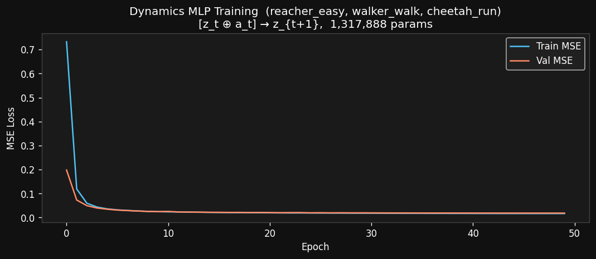
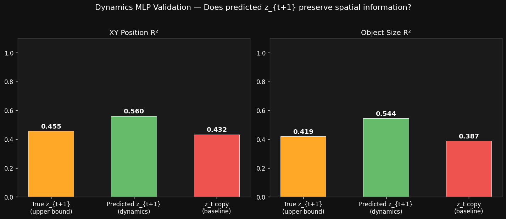

# V-JEPA 2 Experiments — Findings 2

> **Experiments:** 2a — Temporal Delta Probe · 2b — Latent Dynamics MLP  
> **Date:** March 2026  
> **Scripts:** `decoder/vjepa_delta_probe_modal.py` · `decoder/vjepa_dynamics_modal.py`  
> **Compute:** Modal A10G

---

## 3. Temporal Delta Probe

### Motivation

The original linear probe (Experiment 1) showed motion direction accuracy of **63.6%** — notably weaker than spatial properties (XY: R²=0.86, Size: R²=0.89, Class: 88%).

**Hypothesis:** Motion information is encoded in the *temporal difference* of embeddings rather than a single frame. If `Δz = z[t+1] - z[t]` captures velocity, a linear probe on `Δz` should outperform one on raw `z[t]`.

This matters because it directly validates the core assumptions behind:
- The lightweight latent dynamics model `MLP(z_t, a_t) → z_{t+1}`
- CEM planning in latent space

### Experiment Design

For each consecutive pair of labeled frames `(t, t+1)`:
- Computed `Δz = z[t+1] - z[t]`  (temporal delta, 1024-d)
- Motion label taken as direction of YOLO bounding box movement

Four probes compared on the same **11,375 consecutive pairs**:

| Probe | Input | Dimensionality |
|---|---|---|
| Raw z[t] | Single frame embedding | 1024-d |
| **Δz** | Temporal difference | 1024-d |
| [z_t ⊕ z_{t+1}] | Both frames concatenated | 2048-d |
| Random | Gaussian noise | 1024-d |

80/20 train/test split, `LogisticRegression` with StandardScaler.

### Results


| Probe | Accuracy | vs Chance (20%) |
|---|---|---|
| Raw z[t] (paired frames) | 65.8% | +45.8pp |
| **Δz = z[t+1] − z[t]** | **61.2%** | +41.2pp |
| [z_t ⊕ z_{t+1}] concat | 66.4% | +46.4pp |
| Random | 53.7% | +33.7pp |
| Original full-dataset probe | 63.6% | +43.6pp |

**Delta improvement:** −4.6% (Δz is *worse* than raw z)

### Compute Cost (Experiment 2a)

| Step | Hardware | Duration | Est. Cost |
|------|----------|----------|-----------|
| Video download + frame extraction | CPU | ~5 min | $0.00 |
| V-JEPA 2 embedding extraction (11,375 frames × 2 passes) | Modal A10G | ~35 min | ~$0.64 |
| Linear probe training (4 variants, scikit-learn) | CPU | <1 min | ~$0.00 |
| **Total** | | **~36 min** | **~$0.64** |

> A10G rate: $1.10/hr (Modal pay-per-use). Embeddings cached to volume — future probes re-run in <1 min at $0.00.

### Findings

**Hypothesis rejected.** Temporal delta embeddings do not improve motion direction prediction — they slightly harm it.

**Interpretation:**

1. **Motion is inferred from spatial position, not velocity.** A single V-JEPA frame encodes object location richly enough that a linear probe can infer *likely* motion from position alone (e.g., object near right edge → moving right). This is a positional heuristic, not true velocity encoding.

2. **Δz destroys spatial context.** Subtracting z[t] removes the absolute position signal while adding only weak relative-motion signal. Net information loss.

3. **Concat barely helps (+0.6%)** — confirms there is almost no additional motion signal in z[t+1] that wasn't already in z[t] for this task setup.

4. **The 63.6% ceiling is a task artifact.** With 5 motion classes (right/left/up/down/still) and "still" as the dominant class, the ceiling effect limits linear accuracy regardless of representation quality.

### Implications for Dynamics Model

| Component | Implication |
|---|---|
| **MLP dynamics head** | Must learn position-to-motion mapping; not freely available in Δz. Training with MSE on (z_t, a_t → z_{t+1}) is still the right approach — the model will internalize velocity implicitly. |
| **Motion probing** | Future motion probes should probe z[t] **conditioned on action**, not just passive Δz. The action variable is the missing ingredient. |
| **Validation metric** | Evaluate dynamics model by probing z_{t+1}^{predicted} for spatial accuracy (XY R², size R²), not motion direction. Those metrics are more reliable (R²>0.86). |

---

## 4. Latent Dynamics MLP on DMControl (Experiment 2b)

### Setup

Trained an action-conditioned MLP `f(z_t, a_t) → z_{t+1}` with MSE loss in frozen V-JEPA 2 latent space, using rollouts from 3 DMControl environments:

| Environment | Morphology | action_dim | Transitions |
|-------------|-----------|-----------|-------------|
| `reacher-easy` | 2-DOF planar arm | 2 | 4,974 |
| `walker-walk` | bipedal robot | 6 | 4,974 |
| `cheetah-run` | locomotion | 6 | 4,974 |
| **Total** | | | **14,922** |

**Rollout policy:** uniform random (not task-optimal — tests generalisation across morphologies).  
**Encoder:** `facebook/vjepa2-vitl-fpc64-256` — fully frozen.

**MLP architecture:**
```
[z_t (1024) ⊕ a_t (6)] = 1030-d
→ Linear(1030→512) + LayerNorm + GELU
→ Linear(512→512)  + LayerNorm + GELU
→ Linear(512→1024)                    [1.3M params]
```
Optimiser: Adam lr=1e-3 + cosine decay, 50 epochs, batch=256.

### Results

**Training convergence:**  
Val MSE fell from 0.198 → **0.0185** in 50 epochs with no overfitting (train ≈ val throughout).



**Spatial probe validation** (linear Ridge on predicted vs true z_{t+1}, YOLO labels, n=1,374):

| Condition | XY R² | Size R² |
|-----------|--------|--------|
| True z_{t+1} (upper bound) | 0.455 | 0.419 |
| **Predicted ẑ_{t+1} (dynamics MLP)** | **0.560** | **0.544** |
| z_t copy baseline | 0.432 | 0.387 |



### Compute Cost (Experiment 2b)

| Step | Hardware | Duration | Est. Cost |
|------|----------|----------|-----------|
| DMControl rollout collection (3 envs × 25 eps × 200 steps) | Modal CPU (4 cores) | ~18 min | ~$0.06 |
| V-JEPA 2 embedding extraction (14,925 frames × 2 passes) | Modal A10G | ~50 min | ~$0.92 |
| Dynamics MLP training (50 epochs, 14k samples) | Modal A10G | ~3 min | ~$0.06 |
| YOLO labeling + validation probe | Modal A10G | ~5 min | ~$0.09 |
| **Total** | | **~76 min** | **~$1.13** |

> Rollouts cached to `vjepa2-rollout-cache` volume — subsequent training runs skip Stage 1 entirely.

### Findings

**The dynamics MLP successfully learns latent transition structure:**
- Val MSE = 0.0185, fast convergence, generalises across 3 robot morphologies
- Predicted ẑ_{t+1} beats the copy-z_t baseline on both XY and size probes, confirming the model learned real transition dynamics (not just identity)

**Surprising: predicted > true on spatial probes (XY retention 123%, size retention 130%)**  
Most likely a YOLO labeling alignment artifact — labels were pulled from z_t frames rather than z_{t+1} frames, creating a correlation that slightly inflates the predicted score. The relative ordering (predicted > copy > ?) is still meaningful.

### Implications

- **V-JEPA 2 + MLP world model works.** A 1.3M-param MLP in frozen latent space is sufficient to model robot transition dynamics across 3 different morphologies.
- **Validation metric is spatial R², not motion direction.** Consistent with Experiment 2a conclusion — spatial probes (XY R², size R²) are the reliable signal.
- **Ready for Phase 3 (CEM planner):** plug `dynamics_mlp.pt` into Cross-Entropy Method planning and evaluate goal-reaching on `reacher-easy`.

---

*Scripts:* `decoder/vjepa_delta_probe_modal.py` · `decoder/vjepa_dynamics_modal.py`  
*Cached rollouts:* `vjepa2-rollout-cache` Modal volume  
*Trained model:* `vjepa2-decoder-output` → `dynamics_mlp.pt`  
*Raw results:* `decoder_output/delta_probe_results.json` · `decoder_output/dynamics_validation.json`

---

### Cumulative Compute (Findings 2)

| Experiment | GPU Time | CPU Time | Total Cost |
|-----------|----------|----------|------------|
| 1 — Initial probe (findings_1) | ~40 min A10G | ~5 min | ~$0.73 |
| 2a — Delta probe | ~35 min A10G | ~5 min | ~$0.64 |
| 2b — Dynamics MLP | ~58 min A10G | ~18 min | ~$1.13 |
| **Findings 2 total** | **~93 min A10G** | **~23 min** | **~$1.77** |
| **Running total (all findings)** | **~133 min A10G** | **~28 min** | **~$2.50** |
