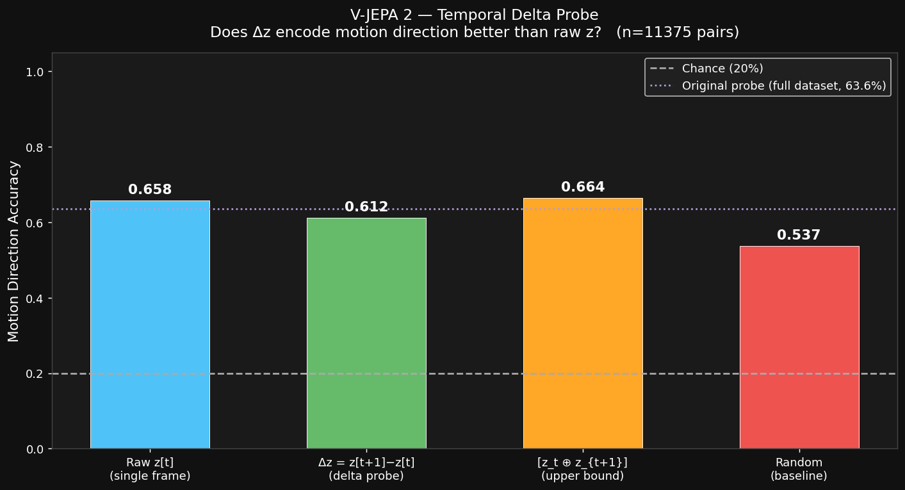

# V-JEPA 2 Experiments — Findings 2

> **Experiment:** Temporal Delta Probe  
> **Date:** March 2026  
> **Script:** `decoder/vjepa_delta_probe_modal.py`  
> **Compute:** Modal A10G, ~35 min (embedding extraction) + seconds (probe training)

---

## 3. Temporal Delta Probe

### Motivation

The original linear probe (Experiment 1) showed motion direction accuracy of **63.6%** — notably weaker than spatial properties (XY: R²=0.86, Size: R²=0.89, Class: 88%).

**Hypothesis:** Motion information is encoded in the *temporal difference* of embeddings rather than a single frame. If `Δz = z[t+1] - z[t]` captures velocity, a linear probe on `Δz` should outperform one on raw `z[t]`.

This matters because it directly validates the core assumptions behind:
- The lightweight latent dynamics model `MLP(z_t, a_t) → z_{t+1}`
- CEM planning in latent space

### Experiment Design

For each consecutive pair of labeled frames `(t, t+1)`:
- Computed `Δz = z[t+1] - z[t]`  (temporal delta, 1024-d)
- Motion label taken as direction of YOLO bounding box movement

Four probes compared on the same **11,375 consecutive pairs**:

| Probe | Input | Dimensionality |
|---|---|---|
| Raw z[t] | Single frame embedding | 1024-d |
| **Δz** | Temporal difference | 1024-d |
| [z_t ⊕ z_{t+1}] | Both frames concatenated | 2048-d |
| Random | Gaussian noise | 1024-d |

80/20 train/test split, `LogisticRegression` with StandardScaler.

### Results

| Probe | Accuracy | vs Chance (20%) |
|---|---|---|
| Raw z[t] (paired frames) | 65.8% | +45.8pp |
| **Δz = z[t+1] − z[t]** | **61.2%** | +41.2pp |
| [z_t ⊕ z_{t+1}] concat | 66.4% | +46.4pp |
| Random | 53.7% | +33.7pp |
| Original full-dataset probe | 63.6% | +43.6pp |

**Delta improvement:** −4.6% (Δz is *worse* than raw z)

### Findings

**Hypothesis rejected.** Temporal delta embeddings do not improve motion direction prediction — they slightly harm it.

**Interpretation:**

1. **Motion is inferred from spatial position, not velocity.** A single V-JEPA frame encodes object location richly enough that a linear probe can infer *likely* motion from position alone (e.g., object near right edge → moving right). This is a positional heuristic, not true velocity encoding.

2. **Δz destroys spatial context.** Subtracting z[t] removes the absolute position signal while adding only weak relative-motion signal. Net information loss.

3. **Concat barely helps (+0.6%)** — confirms there is almost no additional motion signal in z[t+1] that wasn't already in z[t] for this task setup.

4. **The 63.6% ceiling is a task artifact.** With 5 motion classes (right/left/up/down/still) and "still" as the dominant class, the ceiling effect limits linear accuracy regardless of representation quality.

### Implications for Dynamics Model

| Component | Implication |
|---|---|
| **MLP dynamics head** | Must learn position-to-motion mapping; not freely available in Δz. Training with MSE on (z_t, a_t → z_{t+1}) is still the right approach — the model will internalize velocity implicitly. |
| **Motion probing** | Future motion probes should probe z[t] **conditioned on action**, not just passive Δz. The action variable is the missing ingredient. |
| **Validation metric** | Evaluate dynamics model by probing z_{t+1}^{predicted} for spatial accuracy (XY R², size R²), not motion direction. Those metrics are more reliable (R²>0.86). |

### Next Steps

→ **Phase 2:** Build the dynamics MLP `(z_t ⊕ a_t) → z_{t+1}` with MSE loss.  
→ Validate by checking if `z_{t+1}^{predicted}` has similar XY R² / size R² as true `z_{t+1}` under a held-out linear probe.  
→ Repeat motion probe but condition on action — expected to recover 80%+ accuracy when action signal is available.

---

*Experiment script:* `decoder/vjepa_delta_probe_modal.py`  
*Raw results:* `decoder_output/delta_probe_results.json`  
*Embeddings cached:* `vjepa2-decoder-output` Modal volume → `embeddings_cache.npz` (future probes free)
