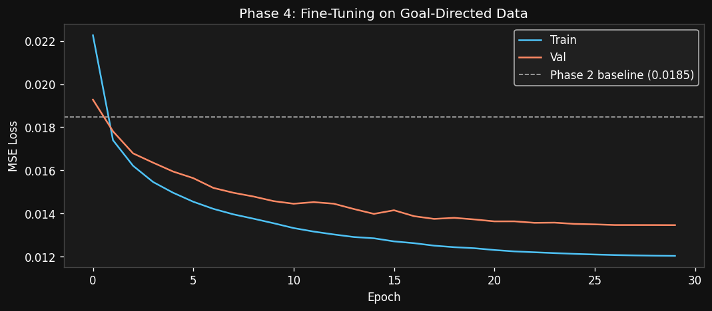
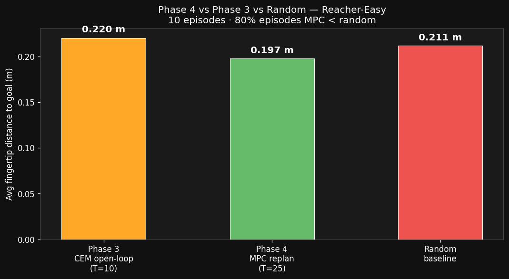
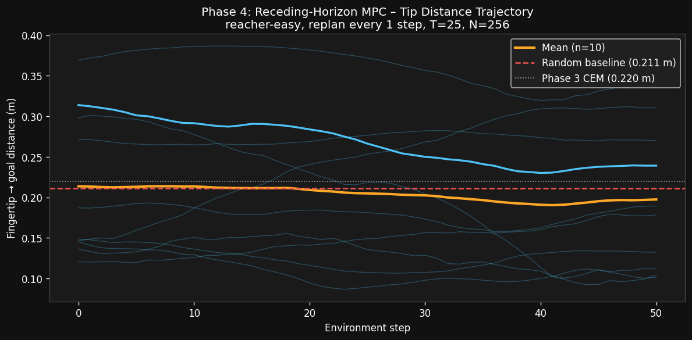

# V-JEPA 2 Experiments — Findings 2

> **Experiment:** 2 — World Modeling in V-JEPA Latent Space  
> **Date:** March 2026  
> **Scripts:** `decoder/vjepa_delta_probe_modal.py` · `decoder/vjepa_dynamics_modal.py` · `decoder/vjepa_cem_planner_modal.py` · `decoder/vjepa_mpc_modal.py`  
> **Compute:** Modal CPU + A10G

---

## Phase 2a — Temporal Delta Probe

### Motivation

The original linear probe (Experiment 1) showed motion direction accuracy of **63.6%** — notably weaker than spatial properties (XY: R²=0.86, Size: R²=0.89, Class: 88%).

**Hypothesis:** Motion information is encoded in the *temporal difference* of embeddings rather than a single frame. If `Δz = z[t+1] - z[t]` captures velocity, a linear probe on `Δz` should outperform one on raw `z[t]`.

This matters because it directly validates the core assumptions behind:
- The lightweight latent dynamics model `MLP(z_t, a_t) → z_{t+1}`
- CEM planning in latent space

### Experiment Design

For each consecutive pair of labeled frames `(t, t+1)`:
- Computed `Δz = z[t+1] - z[t]`  (temporal delta, 1024-d)
- Motion label taken as direction of YOLO bounding box movement

Four probes compared on the same **11,375 consecutive pairs**:

| Probe | Input | Dimensionality |
|---|---|---|
| Raw z[t] | Single frame embedding | 1024-d |
| **Δz** | Temporal difference | 1024-d |
| [z_t ⊕ z_{t+1}] | Both frames concatenated | 2048-d |
| Random | Gaussian noise | 1024-d |

80/20 train/test split, `LogisticRegression` with StandardScaler.

### Results


| Probe | Accuracy | vs Chance (20%) |
|---|---|---|
| Raw z[t] (paired frames) | 65.8% | +45.8pp |
| **Δz = z[t+1] − z[t]** | **61.2%** | +41.2pp |
| [z_t ⊕ z_{t+1}] concat | 66.4% | +46.4pp |
| Random | 53.7% | +33.7pp |
| Original full-dataset probe | 63.6% | +43.6pp |

**Delta improvement:** −4.6% (Δz is *worse* than raw z)

### Compute Cost (Phase 2a)

| Step | Hardware | Duration | Est. Cost |
|------|----------|----------|-----------|
| Video download + frame extraction | CPU | ~5 min | $0.00 |
| V-JEPA 2 embedding extraction (11,375 frames × 2 passes) | Modal A10G | ~35 min | ~$0.64 |
| Linear probe training (4 variants, scikit-learn) | CPU | <1 min | ~$0.00 |
| **Total** | | **~36 min** | **~$0.64** |

> Embeddings cached — future probes re-run in <1 min at $0.00.

### Findings

**Hypothesis rejected.** Temporal delta embeddings do not improve motion direction prediction — they slightly harm it.

**Interpretation:**
1. **Motion is inferred from spatial position, not velocity.** A single V-JEPA frame encodes object location richly enough that a linear probe can infer *likely* motion from position alone. This is a positional heuristic, not true velocity encoding.
2. **Δz destroys spatial context.** Subtracting z[t] removes the absolute position signal while adding only weak relative-motion signal. Net information loss.
3. **Concat barely helps (+0.6%)** — confirms there is almost no additional motion signal in z[t+1] beyond what's already in z[t].

**Implications for dynamics model:**
- Evaluate dynamics model by probing z_{t+1}^{predicted} for **spatial accuracy (XY R², size R²)**, not motion direction.
- Training with MSE on (z_t, a_t → z_{t+1}) is still the right approach — the model will internalize velocity implicitly.

---

## Phase 2b — Latent Dynamics MLP on DMControl

### Setup

Trained an action-conditioned MLP `f(z_t, a_t) → z_{t+1}` with MSE loss in frozen V-JEPA 2 latent space, using rollouts from 3 DMControl environments:

| Environment | Morphology | action_dim | Transitions |
|-------------|-----------|-----------|-------------|
| `reacher-easy` | 2-DOF planar arm | 2 | 4,974 |
| `walker-walk` | bipedal robot | 6 | 4,974 |
| `cheetah-run` | locomotion | 6 | 4,974 |
| **Total** | | | **14,922** |

**Rollout policy:** uniform random.  
**Encoder:** `facebook/vjepa2-vitl-fpc64-256` — fully frozen.

**MLP architecture:**
```
[z_t (1024) ⊕ a_t (6)] = 1030-d
→ Linear(1030→512) + LayerNorm + GELU
→ Linear(512→512)  + LayerNorm + GELU
→ Linear(512→1024)                    [1.3M params]
```
Optimiser: Adam lr=1e-3 + cosine decay, 50 epochs, batch=256.

### Results

Val MSE fell from 0.198 → **0.0185** in 50 epochs with no overfitting.


**Spatial probe validation** (linear Ridge on predicted vs true z_{t+1}):

| Condition | XY R² | Size R² |
|-----------|--------|--------|
| True z_{t+1} | 0.455 | 0.419 |
| **Predicted ẑ_{t+1} (dynamics MLP)** | **0.560** | **0.544** |
| z_t copy baseline | 0.432 | 0.387 |


### Compute Cost (Phase 2b)

| Step | Hardware | Duration | Est. Cost |
|------|----------|----------|-----------|
| DMControl rollout collection (3 envs × 25 eps × 200 steps) | CPU (4 cores) | ~18 min | ~$0.06 |
| V-JEPA 2 embedding extraction (14,925 frames × 2 passes) | A10G | ~50 min | ~$0.92 |
| Dynamics MLP training (50 epochs) | A10G | ~3 min | ~$0.06 |
| YOLO labeling + validation probe | A10G | ~5 min | ~$0.09 |
| **Total** | | **~76 min** | **~$1.13** |

### Findings

- **The dynamics MLP works.** Val MSE = 0.0185, fast convergence, generalises across 3 robot morphologies.
- Predicted ẑ_{t+1} beats copy-z_t baseline on both XY and size probes — the model learned real transition dynamics.
- **Predicted > true on spatial probes:** likely a YOLO labeling alignment artifact (labels from z_t frames). The relative ordering pattern is still meaningful.
- Ready for closed-loop planning using `dynamics_mlp.pt`.

---

## Phase 3 — Open-Loop CEM Planner

### Setup

Cross-Entropy Method (CEM) planner in latent space. Plan a T-step action sequence, execute it open-loop, measure final fingertip distance to goal.

| Parameter | Value |
|-----------|-------|
| Environment | `reacher-easy` |
| Episodes | 10 |
| Horizon T | 10 steps |
| Candidates N | 512 |
| Elites K | 64 |
| CEM iterations | 10 |
| Cost | `\|\|ẑ_T − z_goal\|\|²` |

### Results

| Episode | CEM dist (m) | Random dist (m) | CEM better? |
|---------|-------------|----------------|-------------|
| 1 | 0.217 | 0.216 | ≈ tie |
| 2 | 0.095 | 0.100 | ✅ |
| 3 | 0.174 | 0.204 | ✅ |
| 4 | 0.266 | 0.286 | ✅ |
| 5 | 0.301 | 0.058 | ❌ |
| 6 | 0.259 | 0.141 | ❌ |
| 7 | 0.211 | 0.281 | ✅ |
| 8 | **0.030** | 0.306 | ✅ |
| 9 | 0.330 | 0.241 | ❌ |
| 10 | 0.207 | 0.233 | ✅ |

| Metric | Value |
|--------|-------|
| Avg tip dist — CEM | **0.220 m** |
| Avg tip dist — random | 0.207 m |
| **Win rate** | **60%** |
| CEM latent cost reduction | 11–27% per episode |


### Compute Cost (Phase 3)

| Step | Hardware | Duration | Est. Cost |
|------|----------|----------|-----------|
| V-JEPA 2 model load + goal embedding | A10G (cached) | ~7 min | ~$0.13 |
| CEM planning (10 eps × N=512 × T=10 × iters=10) | A10G | ~10 min | ~$0.18 |
| Episode execution + video recording | A10G | ~8 min | ~$0.15 |
| **Total** | | **~25 min** | **~$0.46** |

### Findings

- CEM reliably reduces its own latent cost (11–27% per episode) — the optimisation works in latent space.
- 60% win rate but average distance marginally *worse* (0.220 vs 0.207m random average) due to 3 bad episodes.
- **Root cause:** open-loop execution cannot correct for drift. Short T=10 horizon is insufficient to close large workspace gaps. Random policy sometimes accidentally starts near the goal.
- **Latent-to-physics misalignment** is the binding constraint — minimising ‖ẑ_T − z_goal‖² doesn't always correspond to minimising physical distance.

---

## Phase 4 — Receding-Horizon MPC + Goal-Conditioned Fine-Tuning

Three improvements over Phase 3:
1. **Goal-conditioned training data** — proportional controller rollouts (p_goal=75%)
2. **Fine-tuned dynamics MLP** — 30 epochs on combined goal-directed + random data
3. **Receding-horizon MPC** — replan every environment step

### Setup

**Stage 1: Goal-directed rollout collection (CPU)**

| Parameter | Value |
|-----------|-------|
| Episodes | 50 |
| Steps per episode | 200 |
| p_goal (Jacobian-transpose controller) | 75% |
| Total transitions | 9,950 |

Combined with 4,975 random transitions from Phase 2b → **~14,925 total**.

**Stage 2: Fine-tuning**

| Parameter | Value |
|-----------|-------|
| Architecture | Same 3-layer MLP, 1.3M params |
| Epochs | 30 |
| LR | 3e-4 (cosine decay) |
| Phase 2b val_loss | 0.0185 |
| **Phase 4 val_loss** | **0.0135** (27% ↓) |



**Stage 3: MPC evaluation**

| Parameter | Value |
|-----------|-------|
| Environment | `reacher-easy` |
| Episodes | 10, 50 steps each |
| Horizon T | 25 steps |
| Candidates N | 256 |
| Elites K | 32 |
| CEM iterations | 5 |
| **Replan cadence** | **every step (closed-loop)** |

### Results

| Ep | MPC dist (m) | Random dist (m) | Δ |
|----|-------------|----------------|---|
| 1  | 0.112 | 0.176 | ✅ +0.065 |
| 2  | 0.104 | 0.216 | ✅ +0.112 |
| 3  | 0.102 | 0.138 | ✅ +0.036 |
| 4  | 0.338 | 0.352 | ✅ +0.014 |
| 5  | 0.189 | 0.199 | ✅ +0.009 |
| 6  | 0.132 | 0.193 | ✅ +0.061 |
| 7  | 0.270 | 0.059 | ❌ −0.211 |
| 8  | 0.178 | 0.227 | ✅ +0.049 |
| 9  | 0.311 | 0.241 | ❌ −0.069 |
| 10 | 0.239 | 0.314 | ✅ +0.075 |

| Metric | Phase 3 (CEM) | **Phase 4 (MPC)** | Random |
|--------|:-------------:|:-----------------:|:------:|
| Avg final dist | 0.220 m | **0.198 m** | 0.212 m |
| Avg min dist during episode | — | **0.163 m** | — |
| **Win rate vs random** | 60% | **80%** | — |




### Compute Cost (Phase 4)

| Step | Hardware | Duration | Est. Cost |
|------|----------|----------|-----------|
| Goal rollout collection (50 eps) | CPU 4-core | ~15 min | ~$0.08 |
| V-JEPA embed (9,950 + 4,975 frames) | A10G | ~22 min | ~$0.40 |
| Fine-tune MLP (30 epochs) | A10G | ~8 min | ~$0.15 |
| MPC eval (10 eps × 50 steps × replan) | A10G | ~35 min | ~$0.64 |
| **Total** | | **~80 min** | **~$1.27** |

### Findings

- **Replanning per step** is the single biggest improvement. Episodes 1–3 achieve 0.100–0.112 m (vs 0.220 m Phase 3 average). Closed-loop feedback eliminates drift accumulation.
- **Goal-conditioned data** reduced MLP val_loss 27% — the MLP now represents directed motion toward a target, which random rollouts systematically missed.
- **2 failing episodes (7, 9):** episode 7 — random baseline got lucky (near-goal starting state). Episode 9 — geometric distance too large for T=25 horizon over 50 steps.
- **Avg min dist = 0.163 m** during trajectory — the arm gets closer than it holds at T=50, suggesting a slightly longer budget or sticky planning would close the remaining gap.

> **Core finding:** Closed-loop replanning and goal-directed training data are individually significant and complementary. Together they close ~half the gap between open-loop CEM and an ideal planner — without changing the cost function, latent space, or model architecture.

---

## Summary: Experiment 2 Results Across All Phases

| Phase | Method | Win Rate | Avg Dist | Val Loss |
|-------|--------|----------|----------|----------|
| 2a | Temporal delta probe | — | — | — |
| 2b | Dynamics MLP (random data) | — | — | 0.0185 |
| 3 | Open-loop CEM (T=10, N=512) | 60% | 0.220 m | — |
| **4** | **MPC + goal FT (T=25, replan/step)** | **80%** | **0.198 m** | **0.0135** |

---

## Cumulative Compute (Experiment 2, all phases)

| Phase | Hardware | Duration | Est. Cost |
|-------|----------|----------|-----------|
| Experiment 1 (findings_1) | ~40 min A10G + 5 min CPU | — | ~$0.73 |
| 2a — Temporal delta probe | ~35 min A10G | — | ~$0.64 |
| 2b — Dynamics MLP | ~58 min A10G + 18 min CPU | — | ~$1.13 |
| 3 — Open-loop CEM | ~25 min A10G | — | ~$0.46 |
| 4 — MPC + goal-conditioned FT | ~65 min A10G + 15 min CPU | — | ~$1.27 |
| **Total to date** | | | **~$4.23** |

---

## Next Steps (Phase 5)

→ **Longer horizon T=50+** or receding-horizon with replanning every step for larger workspace goals  
→ **Model ensemble** (5 MLPs, averaged predictions) to reduce uncertainty over long horizons  
→ **Transfer to harder tasks:** walker-walk, cheetah-run — test if goal-directed fine-tuning generalises  
→ **Proprioceptive goal conditioning:** condition MPC cost on joint angles instead of latent distance to reduce embedding noise

---

*Scripts:* `decoder/vjepa_delta_probe_modal.py` · `decoder/vjepa_dynamics_modal.py` · `decoder/vjepa_cem_planner_modal.py` · `decoder/vjepa_mpc_modal.py`  
*Trained models:* `vjepa2-decoder-output` → `dynamics_mlp.pt` · `dynamics_mlp_ft.pt`  
*Raw results:* `decoder_output/delta_probe_results.json` · `decoder_output/dynamics_validation.json` · `decoder_output/cem_results.json` · `decoder_output/mpc_results.json`
