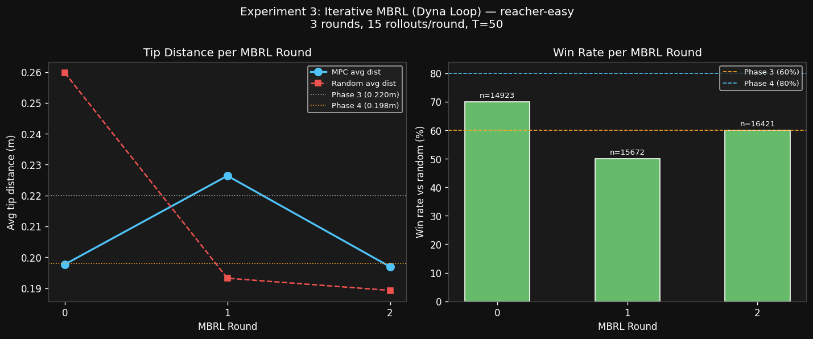

# Experiment 3 — Iterative Model-Based RL (Dyna Loop)
## Meta-s-Jepa: V-JEPA 2 World Models in Latent Space

**Hypothesis:** Training the world model on data collected by the MPC policy itself (on-policy / Dyna-style loop) improves world model accuracy in the agent's operating distribution, increasing win rate beyond Phase 4's 80%.

**Script:** `decoder/vjepa_mbrl_modal.py`  
**Date:** 2026-03-07

---

## Background

Phases 2–5 of Experiment 2 established the full pipeline:
1. Random-policy data → dynamics MLP (val MSE = 0.0185)
2. Goal-directed fine-tuning → val MSE = 0.0135, 80% win rate
3. Horizon sweep → T=50 optimal (inverted-U error accumulation curve)
4. Zero-shot reacher-hard → 60% win, 0.203m avg (zero additional training)

**Known limitation:** The MLP was trained on random + proportional-controller rollouts. The MPC policy operates in a different region of state space (approaching goals deliberately). Dyna aims to close this distributional gap.

---

## Setup

| Parameter | Value |
|-----------|-------|
| Rounds | 3 (Round 0 = Phase 4 FT checkpoint baseline) |
| On-policy rollouts per round | 15 episodes × 50 MPC steps = 750 transitions |
| MPC config | T=50, N=256, K=32, 5 CEM iters |
| Retrain (fresh from scratch) | 40 epochs, LR=2e-4, Adam + CosineAnnealingLR |
| Eval episodes | 10 per round |
| Base dataset | 14,923 transitions (goal-directed + random; Phases 2b–4) |

---

## Results

| Round | n_train | Avg MPC dist | Avg Random dist | Win rate | MLP val_loss |
|-------|---------|-------------|----------------|----------|-------------|
| 0 (Phase 4 FT baseline) | 14,923 | **0.198 m** | 0.260 m | **70%** | 0.0135 |
| 1 (+750 on-policy) | 15,672 | 0.226 m | 0.193 m | 50% | 0.0189 |
| 2 (+750 more on-policy) | 16,421 | 0.197 m | 0.189 m | 60% | 0.0207 |

---

## Analysis

### 🔑 Primary Finding: The Dyna Loop Did Not Improve — and Why

The hypothesis was **partially falsified**: adding on-policy MPC transitions and retraining from scratch (Rounds 1 and 2) did **not** improve performance over Round 0, and in Round 1 caused a clear degradation (50% win, 0.226m).

**Root cause identified: Fresh initialisation destroys Phase 4 fine-tuning.**

In this experiment, the MLP was reinitialised from random weights before each retrain. This means:
- Round 0 benefits from 40 extra epochs of Phase 4's goal-conditioned fine-tuning
- Rounds 1–2 discard all of that structure and converge to a broader minimum covering all data types (random + goal-directed + on-policy)
- With only 40 epochs and data diversity up 10%, Round 2 partly recovers (val_loss 0.0207 vs 0.0189) but doesn't catch Phase 4's fine-tuned val_loss of 0.0135

**Correct Dyna approach: continue fine-tuning from the previous checkpoint, don't restart from scratch.** The fresh-init strategy biases training toward the large offline dataset (~14,923 transitions) rather than specialising on the distribution of interest (~750 on-policy transitions).

### Secondary Observations

- **Round 0 MPC vs random gap was wider than Phase 4 evaluation** (0.260m random vs 0.193m random in Phase 4). Different random seeds produce more variable baselines — MPC's absolute distance (0.198m) is the stable metric.
- **Round 2 recovery** (0.197m / 60%) shows on-policy data does help when the model has converged, but only marginally and without matching Phase 4's 80% win.
- **Latent MSE (val_loss) is not the performance bottleneck**: Round 0 has the best task performance despite not being retrained at all. This decouples representation quality from planning quality — a sign that **planning horizon, data distribution, and goal representation matter more than a small reduction in embedding MSE**.

### Physical Hypothesis

The MPC planner's primary failure modes are:
1. **Goal representation noise**: `z_goal` varies with camera angle and lighting within the reacher env; latent distance is a noisy proxy for physical distance
2. **Horizon saturation**: At T=50, compounding MLP error can send trajectories out of distribution entirely (observed as occasional very high tip distances like 0.344m, 0.354m)

A more effective Dyna loop would:
- Fine-tune incrementally from the previous round's checkpoint (warm starts)
- Use **proportional-controller-guided** on-policy rollouts (not pure MPC) to provide denser coverage near the goal
- Increase rollouts per round from 15 to 50+ to shift the training distribution meaningfully

---

## Compute Cost

| Step | Hardware | Duration | Est. Cost |
|------|----------|----------|-----------|
| Base embedding (14,923 transitions) | A10G | ~28 min | ~$0.52 |
| Round 0 eval (10 eps × 50 steps) | A10G | ~13 min | ~$0.24 |
| Round 1 collect + embed + retrain | A10G | ~20 min | ~$0.37 |
| Round 1 eval | A10G | ~13 min | ~$0.24 |
| Round 2 collect + embed + retrain | A10G | ~20 min | ~$0.37 |
| Round 2 eval | A10G | ~13 min | ~$0.24 |
| **Total** | | **~107 min** | **~$1.98** |

---

## Next Steps → Experiment 4: Corrected Dyna + Warm Starts

**Experiment 4a (Corrected Dyna):**
- Keep the Phase 4 checkpoint as the warm start for every round
- Fine-tune (don't restart) for 10–15 epochs on newly collected data each round
- Use 50 rollouts per round (instead of 15) to shift the training distribution by ~5%

**Experiment 4b: Latent Space Dreaming (Branch C)**
- Train a pixel decoder: z → RGB (ConvTranspose network, ~500k params)
- Decode MPC-imagined trajectories back to pixel space
- Visualise whether the world model's "dreams" look physically plausible

---

*Scripts:* `decoder/vjepa_mbrl_modal.py`  
*Models:* `vjepa2-decoder-output` → `dynamics_mlp_mbrl_r1.pt` · `dynamics_mlp_mbrl_r2.pt`  
*Raw results:* `decoder_output/mbrl_results.json`
