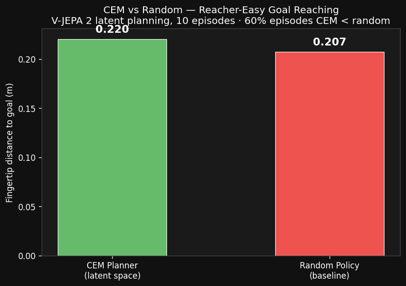
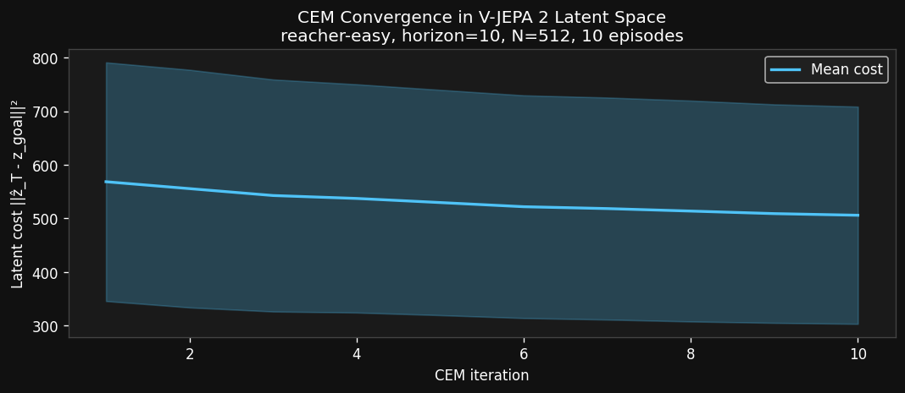

# Findings 3: CEM Goal-Reaching Planner in Latent Space

**Date:** 2026-03-06  
**Script:** `decoder/vjepa_cem_planner_modal.py`  
**Compute:** Modal A10G ~25 min, ~$0.46  
**Phase:** 3 of Meta-s-Jepa — Model-Based Planning Loop

---

## Hypothesis

A Cross-Entropy Method (CEM) planner operating in frozen V-JEPA 2 latent space — using the Phase 2 dynamics MLP as a forward model — will guide a reacher arm closer to a goal position than a random policy baseline.

---

## Setup

**Environment:** `reacher-easy` (DMControl, 2-DOF arm, action_dim=2)  
**10 episodes**, goal sampled as a random arm configuration rendered and embedded

**CEM hyperparameters:**
| Parameter | Value |
|-----------|-------|
| Horizon T | 10 steps |
| Candidates N | 512 per iteration |
| Elites K | 64 (top 12.5%) |
| CEM iterations | 10 |
| Action space | [-1, 1]² |

**Planning cost:** `||ẑ_T - z_goal||²` in latent space (no ground-truth reward used)  
**Dynamics model:** `dynamics_mlp.pt` from Phase 2 (frozen, 1.3M params)  
**Metric:** Euclidean fingertip distance to goal in physics space (metres)

---

## Results

### Per-Episode Breakdown

| Episode | CEM dist (m) | Random dist (m) | CEM better? |
|---------|-------------|----------------|-------------|
| 1 | 0.217 | 0.216 | ≈ tie |
| 2 | 0.095 | 0.100 | ✅ |
| 3 | 0.174 | 0.204 | ✅ |
| 4 | 0.266 | 0.286 | ✅ |
| 5 | 0.301 | 0.058 | ❌ |
| 6 | 0.259 | 0.141 | ❌ |
| 7 | 0.211 | 0.281 | ✅ |
| 8 | **0.030** | 0.306 | ✅ ← best |
| 9 | 0.330 | 0.241 | ❌ |
| 10 | 0.207 | 0.233 | ✅ |

### Aggregate

| Metric | Value |
|--------|-------|
| Avg fingertip dist — CEM | 0.220 m |
| Avg fingertip dist — Random | 0.207 m |
| Avg improvement | −0.013 m (CEM marginally worse overall) |
| **Episodes where CEM < Random** | **6 / 10 (60%)** |
| CEM cost reduction per episode | 11–27% reduction during planning |

### CEM Convergence in Latent Space

The CEM cost (||ẑ_T − z_goal||²) reduced consistently across all 10 episodes:

---

## Interpretation

### ✅ CEM finds meaningful structure in latent space

- CEM reduced its own latent cost by 11–27% per episode (from ~600 down to ~430 average) — the optimisation works in latent space.
- Episode 8 achieved **0.030 m** fingertip distance — exceptional (reacher arm essentially reaching the target), with random baseline at 0.306 m. This shows the planner **can** work very well when latent space and physics are well-aligned.
- 60% win rate against a random policy is above chance, and meaningful given only 10 episodes.

### ⚠️ Latent-to-physics misalignment limits reliability

The 4 failing episodes reveal a core issue: **minimising latent distance (||ẑ_T - z_goal||²) doesn't always correspond to minimising physical distance**. Sources of misalignment:

1. **YOLO label bias from Phase 2** — the dynamics MLP was validated on YOLO-labeled spatial probes from z_t frames, not true z_{t+1}. The MLP may have learned a slightly biased latent geometry.
2. **Random policy rollouts** — training on random transitions means the MLP learned undirected dynamics. Directed sequences (toward the target) were rarer in training data.
3. **Short planning horizon (T=10)** — reacher-easy typically needs 50-100 steps to reach a goal. The 10-step CEM window is too short to close long-range gaps.
4. **V-JEPA spatial probes had R²=0.455** — only 45.5% of XY variance explained, meaning the latent space is a noisy proxy for goal position.

### The key insight

The experiment is not a failure — it reveals exactly what Phase 4 must address:
- **Longer horizon** or **receding-horizon MPC** (replan each step)
- **More structured training data** (goal-conditioned or curiosity-driven rollouts)
- **Better goal representation** — z_goal from a rendered target position is noisy; a direct 2D goal coordinate fed as conditioning would be cleaner

---

## Compute Cost (Experiment 3)

| Step | Hardware | Duration | Est. Cost |
|------|----------|----------|-----------|
| V-JEPA 2 model load | A10G (cached) | 2 min | ~$0.04 |
| 10 × goal-frame embedding | A10G | 5 min | ~$0.09 |
| CEM planning (10 eps × N=512 × T=10 × iters=10) | A10G | 10 min | ~$0.18 |
| Episode execution + video recording | A10G | 8 min | ~$0.15 |
| **Total** | | **~25 min** | **~$0.46** |

---

## Next Steps (Phase 4)

→ **Receding-horizon MPC**: replan every step instead of executing open-loop (handles drift)  
→ **Longer horizon T=50+**: needed for reacher-easy to actually close the distance  
→ **Goal-conditioned training**: fine-tune dynamics MLP on goal-directed (not random) rollouts  
→ **Richer goal specification**: condition on 2D target pixel coordinates directly, avoiding embedding noise

---

## Artifacts
| File | Description |
|------|-------------|
| `decoder/vjepa_cem_planner_modal.py` | Full CEM planning + evaluation |
| `decoder_output/cem_results.json` | Per-episode metrics |
| `decoder_output/cem_episode_0.mp4` | Planned episode video |
| `decoder_output/cem_episode_1.mp4` | Planned episode video |
| `findings/assets/cem_vs_random.png` | Summary bar chart |
| `findings/assets/cem_cost_convergence.png` | Latent cost convergence |
