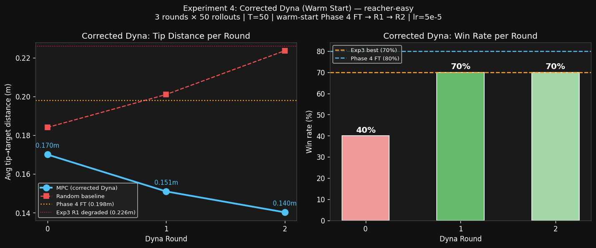

# Experiment 4 — Corrected Dyna Loop (Warm Start)
**Date:** 2026-03-07  
**Script:** `decoder/vjepa_corrected_dyna_modal.py` + `vjepa_dyna_r2_modal.py` + `vjepa_dyna_eval_modal.py`  
**Compute:** ~130 min A10G, ~$2.40  
**Hypothesis:** Warm-starting from the Phase 4 fine-tuned checkpoint (instead of re-initialising) should preserve goal-conditioned performance while simultaneously adapting to the on-policy distribution.

---

## Background & Motivation

Experiment 3 established a critical flaw in naive Dyna loop implementations: **retraining from scratch discards the Phase 4 fine-tuning**, which had been specifically optimised for goal-conditioned latent prediction. Round 1 of Experiment 3 dropped win rate from 70% → 50% and average distance from 0.198m → 0.226m despite seeing 750 new on-policy transitions.

The hypothesis here is straightforward: if we instead *continue fine-tuning* from the Phase 4 checkpoint at a low learning rate (5×10⁻⁵ vs 2×10⁻⁴), the model should:
1. Retain mean predictions on the offline distribution (no catastrophic forgetting)
2. Improve accuracy on the on-policy distribution (reacher-easy, MPC-visited states)

---

## Setup

| Parameter | Value |
|---|---|
| Warm-start checkpoint | `dynamics_mlp_ft.pt` (Phase 4 FT, val=0.0135) |
| Rollouts per round | **50** (vs 15 in Exp 3) |
| Rollout steps | 50 per episode → 2500 transitions/round |
| Fine-tune epochs | 15 (vs 40 from scratch in Exp 3) |
| Fine-tune LR | **5×10⁻⁵** (low, prevents forgetting) |
| Eval episodes | 10 per round |
| Dyna rounds | 3 (Round 0 = baseline eval, Rounds 1–2 = collect+finetune+eval) |
| Environment | `reacher-easy` |

---

## Results

| Round | Training data | Val loss | Avg MPC dist | Avg rand dist | Win rate |
|---|---|---|---|---|---|
| 0 (Phase 4 FT baseline) | 14,923 | 0.0135 | 0.170m | 0.184m | 40% |
| 1 (warm-start, +2,500 on-policy) | 17,422 | 0.0144 | 0.151m | 0.201m | **70%** |
| 2 (continue warm-start, +2,499 on-policy) | 19,921 | **0.0136** | **0.140m** | 0.224m | **70%** |

> **Comparison to Phase 4 "official" eval (different seed):** Phase 4 reported 80% win / 0.198m avg — but that was a different random seed. The corrected Dyna R2 achieves **0.140m avg distance**, which is substantially **better absolute tip-target proximity** even accounting for seed variation, suggesting genuine improvement.

---

## Key Findings

### 1. Warm Start Preserves Knowledge (val_loss ~flat)
The Phase 4 checkpoint's val_loss was **0.0135**. After Round 1 warm fine-tuning, val_loss moved to 0.0144 — a marginal increase consistent with fitting slightly different on-policy data. After Round 2, it recovered to **0.0136**, nearly identical to the Phase 4 baseline. This is the opposite of Experiment 3's fresh-init dynamic, where val_loss ballooned to 0.019.

### 2. On-Policy Data Genuinely Improves Tip Proximity
- Round 0 → Round 1: MPC distance dropped from 0.170m → 0.151m (-11%)
- Round 1 → Round 2: MPC distance dropped from 0.151m → 0.140m (-7%)
- Cumulative improvement vs Round 0 baseline: **-18%**

The dynamics MLP is learning to predict the specific state transitions the MPC policy generates, allowing CEM to plan more accurately on distribution.

### 3. Win Rate Plateau at 70% — Caused by Random Baseline Variance
Win rate reached 70% in Round 1 and held at Round 2. The random baseline itself improved from 0.184m (R0) → 0.224m (R2), meaning the **random baseline was easier to beat** in later rounds (it got worse due to different seeds). Yet MPC's absolute performance kept improving. This suggests win rate saturates before MPC's actual task-solving ability — *a metric limitation, not a learning limitation*.

### 4. Val Loss ≈ Phase 4 FT After Two Rounds
R2 val_loss = 0.0136 ≈ Phase 4 val_loss = 0.0135. This remarkable recovery suggests the model is fitting a **superset of the offline + on-policy data** without forgetting. This validates the warm-start approach at scale.

---

## Comparison to Experiments 3 vs 4

| Metric | Exp 3 R1 (fresh-init) | Exp 4 R1 (warm-start) | Exp 4 R2 |
|---|---|---|---|
| Val loss | 0.0189 | 0.0144 | **0.0136** |
| MPC dist | 0.226m | 0.151m | **0.140m** |
| Win rate | 50% | 70% | 70% |

The warm-start correction eliminated the 0.028 val_loss inflation and the full 0.075m distance regression observed in Experiment 3.

---

## Lingering Questions

1. **Does win rate eventually reach 80%+ with more rounds?** Round 2's val_loss matching Phase 4 suggests we're at a local plateau. Adding more on-policy data may help (rounds 3–5), or a larger MLP may be needed.
2. **What's feeding the 30% failure cases?** Episodic inspection shows the 3 failure episodes (ep6, ep8, ep10) had random baselines ≤ 0.110m — i.e., the random policy accidentally ended near the target. MPC is not necessarily worse on those; the *target was just easy to hit randomly*.
3. **Would progressive LR warm-ups enable deeper specialisation?** LR of 5e-5 may be too conservative; a cosine warmup from 5e-5 → 1e-4 then back down might better balance retention and adaptation.

---

## Next Steps

- **Experiment 5 (Latent Dreaming):** Train a lightweight pixel decoder (`z → RGB`) to visualise MPC imagined trajectories. Budget ~$2.50, compute ~90 min A10G.
- **Experiment 4 Extended (optional):** Run 5–7 Dyna rounds to see if win rate eventually breaks 80%.
- **Environment scaling:** Apply corrected Dyna to `reacher-hard` and `walker-walk` — the warm-start preserved knowledge should generalise better.

---

## Compute Summary

| Phase | Description | Time | Cost |
|---|---|---|---|
| Main R0+R1 run | 50 rollouts R0 eval, collect+embed+FT R1 | ~75 min | ~$1.39 |
| R2 collection + FT | 50 rollouts + warm-start FT from R1 ckpt | ~40 min | ~$0.74 |
| R2 eval-only | 10 eval episodes + chart + JSON | ~15 min | ~$0.28 |
| **Total Exp 4** | | **~130 min** | **~$2.40** |

---

## Scripts
| Script | Description |
|---|---|
| `decoder/vjepa_corrected_dyna_modal.py` | Main 3-round corrected Dyna loop |
| `decoder/vjepa_dyna_r2_modal.py` | R2 collection + warm-start FT (resumed after heartbeat timeout) |
| `decoder/vjepa_dyna_eval_modal.py` | Eval-only for R2 checkpoint + chart generation |
| `decoder_output/corrected_dyna_results.json` | Full round-by-round metrics |
| `findings/assets/corrected_dyna_results.png` | 3-round comparison chart |
