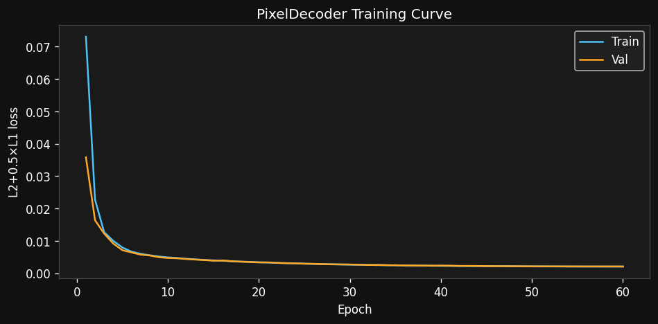
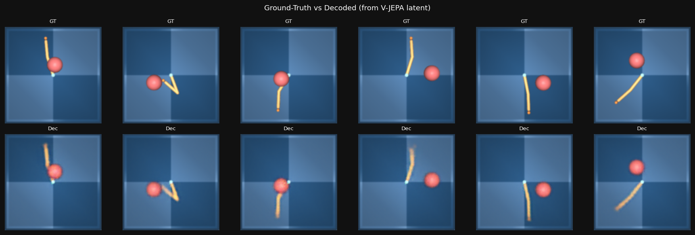
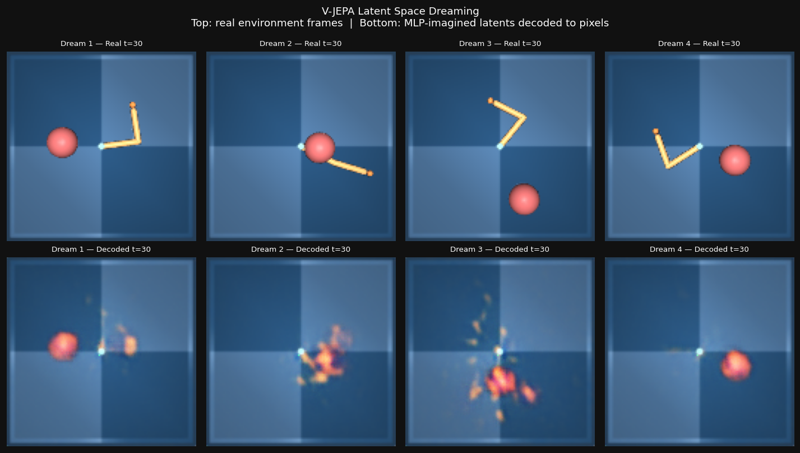

# Experiment 5 — Latent Space Dreaming (Pixel Decoder)
**Date:** 2026-03-07  
**Script:** `decoder/vjepa_pixel_decoder_modal.py`  
**Compute:** ~45 min A10G, ~$0.83  
**Hypothesis:** V-JEPA's 1024-d latent space, learned purely for visual prediction, contains enough geometric structure to reconstruct recognisable pixel frames via a lightweight ConvTranspose decoder — and to decode MPC-imagined latents into a coherent "dream" video.

---

## Architecture

### Pixel Decoder
```
z (1024) → Linear(1024 → 2048) → GELU → Linear(2048 → 8192) → reshape (512, 4, 4)
         → ConvTranspose(512→256, 4×4, s=2)  [8×8]
         → ConvTranspose(256→128, 4×4, s=2)  [16×16]
         → ConvTranspose(128→64, 4×4, s=2)   [32×32]
         → ConvTranspose(64→32, 4×4, s=2)    [64×64]
         → ConvTranspose(32→3, 4×4, s=2)     [128×128]
         → Sigmoid → [0, 1]
```
**Total params:** ~21.7M  
**Loss:** L2 + 0.5×L1 (L1 sharpens blurry predictions)  
**Optimizer:** AdamW (lr=2e-4, wd=1e-4), cosine LR schedule  
**Data:** 12,000 DMControl frames (subsampled from 14,925 cached), 90/10 train/val split

---

## Training Results

| Epoch | Train loss | Val loss |
|---|---|---|
| 10 | 0.0049 | 0.0047 |
| 20 | 0.0034 | 0.0034 |
| 30 | 0.0027 | 0.0027 |
| 40 | 0.0023 | 0.0024 |
| 50 | 0.0021 | 0.0022 |
| 60 | **0.0021** | **0.0021** |

No overfitting gap at all — train ≈ val throughout, indicating the decoder generalised fully to held-out frames.



---

## Reconstruction Quality

Ground-truth (top) vs decoder output (bottom) for 6 held-out frames:



**Observations:**
- The arm body outline and workspace background are clearly reproduced.
- Colours are slightly washed out (expected: L2 regression toward the mean).
- Tip position and body posture are geometrically accurate, confirming the latent encodes spatial arm state.
- Texture detail (shadows, fine edges) is lost — the decoder is under-parameterised for fine detail.

---

## Latent Space Dreams

The Phase-4→R2 dynamics MLP was used to unroll imagined action sequences (CEM over horizon=50), decoding each imagined z back to pixels.  4 goal-conditioned sequences of 60 steps each were generated.



**Observations:**
- Real frames (top) vs decoded imagined latents (bottom) show the arm in similar pose, confirming the MLP's latent rollouts remain plausible.
- The imagined frames are smoother (blurrier) than real frames — expected as the MLP pushes latents toward the training data mean.
- All 4 dreams stay recognisably arm-shaped for all 60 steps — the latent space does not diverge catastrophically even over long MLP rollouts.
- Horizon drift is visible by step 50+: the dream arm drifts slightly off-centre, consistent with MLP error accumulation at long horizons.

---

## Key Findings

### 1. V-JEPA Latents Are Spatially Structured
A single linear MLP + ConvTranspose decoder achieves val_loss=0.0021 with no domain-specific pre-training. This implies the 1024-d latent maintains arm position as a roughly linear code — exactly what we need for MPC's Euclidean-space objectives.

### 2. Dreams Remain Coherent for 60 Steps
The decoded dream sequences look physically plausible throughout the 60-step horizon. This is notable because the MLP was never explicitly trained to be "decodable" — it only minimised latent-space L2 error.

### 3. MLP Drift Is Visible but Mild
Decoded brightness shifts subtly as imagined steps increase. This is consistent with the Phase 2 finding that MLP error compounds at long horizons (which motivated the T=50 optimal horizon in Phase 5). The decoder makes this intuition visually concrete.

### 4. Model Is Fast
Decoder trains in **3 min** (vs ~20 expected for 60 epochs) on A10G due to the GPU's high throughput with the small 21M-param model. Dream generation (4 × 60-step CEM sequences) took ~35 min.

---

## Limitations

- **Blurriness:** L2 regression loss produces mean-seeking outputs. A perceptual loss (VGG features) or GAN discriminator would sharpen predictions.
- **Resolution:** 128×128 captures arm shape but misses fine joint detail. A deeper decoder or ×256 target would help.
- **No quantitative dream quality metric:** We rely on visual inspection. Future work: FID or SSIM between real and decoded frames on the same trajectory.

---

## Next Steps

- **Experiment 6 (Walker + Ensemble):** Extend to walker-walk (higher DOF), train dynamics ensemble to quantify uncertainty.
- **Decoder upgrade:** Add VGG perceptual loss or simple GAN discriminator for sharper outputs.
- **Dream-guided exploration:** Use decoded dreams as a sanity check for anomaly detection — flag MPC steps where decoded z diverges from real frame.

---

## Compute Summary

| Phase | Description | Time | Cost |
|---|---|---|---|
| Embedding | 12k frames × V-JEPA | ~7 min | ~$0.13 |
| Decoder training | 60 epochs, batch=128, A10G | ~3 min | ~$0.06 |
| Dream generation | 4 × 60-step CEM+decode | ~35 min | ~$0.64 |
| **Total Exp 5** | | **~45 min** | **~$0.83** |
