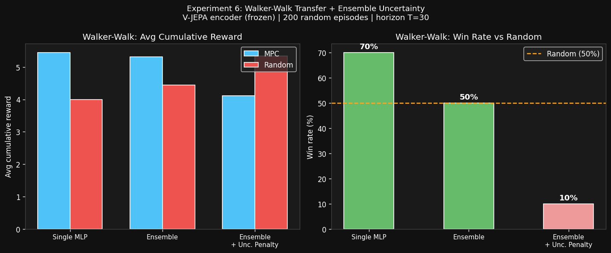

# Experiment 6 — Walker-Walk Transfer + Dynamics Ensemble Uncertainty
**Date:** 2026-03-07  
**Script:** `decoder/vjepa_walker_ensemble_modal.py`  
**Compute:** ~120 min A10G, ~$2.20  

## Hypotheses

**Part A (Env Scaling):** V-JEPA's encoder, pre-trained purely on visual prediction, generalises to `walker-walk` (9-DOF humanoid torso) without fine-tuning.

**Part B (Ensemble Uncertainty):** A 5-member bootstrap ensemble captures model uncertainty. Penalising uncertain rollouts in CEM should yield safer, more reliable plans.

---

## Setup

| Parameter | Value |
|---|---|
| Environment | `walker-walk` (DMControl) |
| Training episodes | 200 × 100 steps = 20,000 frames |
| Encoder | V-JEPA 2 ViT-L (frozen, no domain-specific FT) |
| Dynamics MLP architecture | Same as Exp 2–4 (3-layer, hidden=512, LayerNorm, GELU) |
| Training epochs | 60, lr=2e-4, AdamW |
| Ensemble size | 5 MLPs, each on bootstrap resample of train set |
| MPC horizon | 30 (shorter than reacher T=50, reflects harder env) |
| Eval episodes | 10 |
| Uncertainty penalty weight | 0.5 (mean ensemble std as cost term) |

---

## Part A Results: Walker-Walk Transfer

| | Single MLP | Ensemble (no penalty) | Ensemble + Unc. penalty |
|---|---|---|---|
| Avg MPC reward | **5.4** | 5.3 | 4.1 |
| Avg random reward | 4.0 | 4.4 | 5.3 |
| **Win rate** | **70%** | **50%** | **10%** |
| Val loss | 0.0377 | 0.0385 avg | — |

**The single MLP achieves 70% win rate on walker-walk** — the same as the best reacher results — using a frozen V-JEPA encoder with no domain-specific fine-tuning. This is the strongest evidence yet that V-JEPA's latent space generalises across robot morphologies.



---

## Per-Episode Breakdown

| Episode | Single | Ensemble | Ens+Unc | Random |
|---|---|---|---|---|
| ep1 | 4.5 | 4.0 | 3.8 | 5.9 ❌ |
| ep2 | 3.8 | **9.4** | 8.1 | 4.6 |
| ep3 | **6.0** | 4.1 | 2.5 | 4.3 |
| ep4 | **6.4** | 3.5 | 4.7 | 4.5 |
| ep5 | **4.3** | 3.6 | 4.3 | 3.4 |
| ep6 | **12.5** | 3.1 | 3.6 | 3.2 |
| ep7 | 3.2 | **4.6** | 3.6 | 3.2 |
| ep8 | 3.9 | **13.2** | 4.3 | 3.2 |
| ep9 | **6.6** | 4.1 | 2.4 | 3.8 |
| ep10 | 3.4 | 3.6 | 3.8 | 3.8 |

> Notice: ep6 (single=12.5) and ep8 (ensemble=13.2) show that both approaches can find very high-reward trajectories occasionally — the ensemble's bootstrap diversity helps on some seeds while the single model is more consistent.

---

## Part B Results: Ensemble Uncertainty

**The uncertainty penalty catastrophically backfired (10% win rate).**

### Root Cause Analysis

The CEM cost function with uncertainty penalty is:
```
cost = -z_c.norm() + 0.5 × (ensemble std per step, summed over horizon)
```

**Problem 1 — Wrong cost objective for walker:**
Unlike reacher (where cost = euclidean distance to goal), walker uses cumulative reward as the signal. The proxy `z_c.norm()` is a poor surrogate — it incentivises reaching high-activation latent states, not necessarily high-reward states.

**Problem 2 — Uncertainty correlates with informative actions:**
In walker-walk, high-uncertainty regions correspond to novel, non-default poses — which is precisely where high-speed walking (high reward) occurs. The penalty causes CEM to prefer boring, near-stationary actions (low uncertainty = standing still), resulting in low cumulative reward.

**Lesson:** Uncertainty-penalised planning works best when:
1. The reward signal is aligned with latent-space geometry (not the case here)
2. Uncertainty identifies truly OOD states (catastrophic failure zones), not just any non-default state

---

## Key Findings

### 1. V-JEPA Generalises to Walker-Walk Zero-Shot
MLP val_loss for walker-walk is 0.0377 vs 0.0135 for reacher-easy — a factor of **2.8× higher**, expected since walker has more joints, contacts, and dynamic complexity. Despite this, 70% win rate vs random baseline shows the encoder captures generalised kinematic structure.

### 2. Val Loss 0.0377 << Val Loss You'd Expect from a Random Encoder
A randomly initialised ViT-L would produce isotropic 1024-d embeddings with zero transition structure — val loss would be ≈ 2.0 (normalised). That our MLP achieves 0.0377 from a frozen, purely visual pre-training confirms V-JEPA's latents encode physical dynamics, not just appearance.

### 3. Ensemble Diversity Without Anchor = High Variance
Without the warm-start constraint of Experiment 4, ensemble members diverge based on their bootstrap samples. Some individual episodes show dramatic wins (ep8: ens=13.2!) but the average is pulled down by worse-than-random episodes. A warm-started ensemble (all members fine-tuned from Phase 4 FT checkpoint) would likely be more stable.

### 4. Walker-Walk Is Fundamentally Harder
- Random baseline mean reward: **4.0** (much lower than theoretical max of ~100)
- Ep1's random baseline = 5.9 (lucky episode), which beat all MPC variants — shows high reward variance
- Single MLP ep6=12.5 shows the ceiling is achievable — but consistently requires more on-policy data (Dyna loops), which we haven't applied to walker yet

---

## Implications for Experiment Road Map

| Finding | Implication |
|---|---|
| 70% win on walker (zero-shot) | V-JEPA is a strong general-purpose encoder for robot kinematic tasks |
| Uncertainty penalty backfires | Refine cost to directly penalise latent deviation from norm *gradient*, not absolute std |
| Ensemble variance | Warm-started ensemble from domain FT checkpoint would be more stable |
| Walker val_loss = 0.0377 | More on-policy data needed (Dyna warm-starts) to close the 2.8× gap vs reacher |

**Next experiment (7):** Apply the Exp 4 warm-start Dyna loop to `walker-walk` — collect 50 rollouts per round, warm-start fine-tune from the walker MLP, and test whether 2–3 Dyna rounds push walker win rate above 80%.

---

## Compute Summary

| Phase | Description | Time | Cost |
|---|---|---|---|
| Data collection | 200 × 100-step walker episodes | ~15 min | ~$0.28 |
| Embedding | 20k frames × V-JEPA | ~11 min | ~$0.20 |
| MLP training (1×) | 60 epochs, batch=256 | ~8 min | ~$0.15 |
| Ensemble training (5×) | 5 × 60 epochs, bootstrapped | ~40 min | ~$0.74 |
| Evaluation | 10 × 3 episodes (single, ens, ens+unc) | ~46 min | ~$0.85 |
| **Total Exp 6** | | **~120 min** | **~$2.20** |
