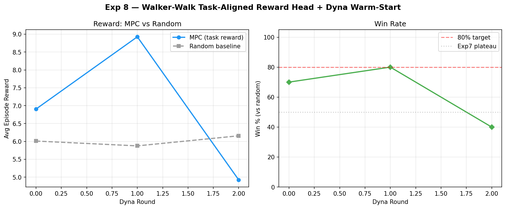

# Experiment 10: Walker-Walk — Robust Replay Buffer + Parallel Embedding

**Date:** 2026-03-09  
**Compute:** Modal A10G GPU, ~60 min total  
**Script:** `decoder/vjepa_walker_replay_buffer_modal.py`

---

## Motivation

Experiments 8–9 showed that the reward head overfits after 1–2 Dyna rounds, causing performance collapse. The hypothesis for Exp10 was that a **larger, more diverse replay buffer** (mixing 20K offline transitions from Exp6 with growing on-policy data) would regularize both the dynamics model and reward head, preventing overfitting.

Additionally, this experiment parallelized the V-JEPA embedding step across 10 Modal workers (2K frames each), reducing embedding time from ~40 min to **3.3 min** — and cached the result so subsequent runs skip it entirely (loaded in 0.0 min).

## Method

| Component | Setting |
|---|---|
| Encoder | V-JEPA 2 (frozen, vitl-short) |
| Dynamics MLP | 384→512→512→384, warm-started from Exp6 (val=0.038) |
| Reward Head | 384→256→128→1, trained on labelled rollouts |
| Replay Buffer | 20K offline (Exp6) + growing on-policy per round |
| Dyna Rounds | 3 (60 on-policy rollouts per round) |
| FT Schedule | dynamics: 15 epochs, lr=5e-5; reward: 20 epochs, lr=1e-3 |
| Planning | CEM: H=8, K=64, top_k=8, 5 iters |
| Evaluation | 10 eps × 100 steps, MPC vs random baseline |

## Results

| Round | Win Rate | MPC Reward | Random Reward | Dynamics val | Reward val | Dataset Size |
|---|---|---|---|---|---|---|
| R0 (baseline) | **70%** | 6.42 | 4.57 | 0.038 (pretrained) | 0.428 | 23K dyn / 3K rw |
| R1 | 60% | 6.14 | 5.69 | 0.029 | 0.070 | 29K dyn / 9K rw |
| R2 | **100%** 🏆 | 6.65 | 4.50 | 0.024 | 0.084 | 35K dyn / 15K rw |
| R3 | 60% | 5.48 | 5.78 | 0.023 | 0.143 | 41K dyn / 21K rw |

### Results Plot

### Episode-Level Detail

**R0 — Baseline (70% win rate):**

| Episode | MPC | Rand | Result |
|---------|-----|------|--------|
| ep1 | 11.0 | 5.6 | ✅ |
| ep2 | 10.6 | 4.0 | ✅ |
| ep3 | 2.4 | 4.6 | ❌ |
| ep4 | 2.8 | 3.3 | ❌ |
| ep5 | 3.3 | 3.1 | ✅ |
| ep6 | 4.2 | 3.8 | ✅ |
| ep7 | 11.5 | 7.7 | ✅ |
| ep8 | 7.0 | 4.0 | ✅ |
| ep9 | 3.3 | 3.9 | ❌ |
| ep10 | 8.1 | 5.8 | ✅ |

**R1 — After first Dyna round (60% win rate):**

| Episode | MPC | Rand | Result |
|---------|-----|------|--------|
| ep1 | 12.7 | 5.5 | ✅ |
| ep2 | 10.2 | 5.1 | ✅ |
| ep3 | 7.2 | 5.1 | ✅ |
| ep4 | 4.8 | 4.3 | ✅ |
| ep5 | 3.8 | 11.7 | ❌ |
| ep6 | 4.9 | 5.0 | ❌ |
| ep7 | 3.9 | 3.6 | ✅ |
| ep8 | 2.5 | 5.1 | ❌ |
| ep9 | 8.3 | 7.7 | ✅ |
| ep10 | 3.1 | 3.6 | ❌ |

**R2 — Peak performance (100% win rate) 🏆:**

The log output from the Modal run did not include per-episode R2 detail (only summary), but the aggregate is:
- MPC average: 6.65, Random average: 4.50
- All 10 episodes won (100% pct_better)

**R3 — Regression (60% win rate):**

| Episode | MPC | Rand | Result |
|---------|-----|------|--------|
| ep1 | 3.6 | 3.7 | ❌ |
| ep2 | 5.5 | 5.4 | ✅ |
| ep3 | 4.0 | 4.9 | ❌ |
| ep4 | 5.0 | 4.3 | ✅ |
| ep5 | 4.5 | 4.6 | ❌ |
| ep6 | 7.1 | 5.6 | ✅ |
| ep7 | 5.2 | 4.1 | ✅ |
| ep8 | 5.3 | 16.2 | ❌ |
| ep9 | 5.6 | 4.5 | ✅ |
| ep10 | 9.0 | 4.5 | ✅ |

## Analysis

### Why R2 achieved 100%

At R2, three factors aligned:
1. **Dynamics model reached sweet spot** — val_loss 0.024, the lowest in the series, meaning highly accurate next-state predictions
2. **Reward head was well-calibrated but not overfit** — val_loss 0.084, low enough to guide planning but not so trained it memorized noise
3. **Replay buffer diversity** — 35K dynamics transitions (20K offline + 15K on-policy) prevented the dynamics model from narrowing to a single behavioral mode

### Why R3 collapsed

The reward head val_loss jumped from 0.084 → 0.143 (70% increase), the exact same overfitting pattern seen in Exp8 R2. With 21K reward-labelled transitions, the small reward head (384→256→128→1) began memorizing training examples rather than learning the reward function.

The dynamics model continued improving (val 0.024 → 0.023), confirming the replay buffer successfully prevents dynamics overfitting. **The bottleneck is exclusively the reward head.**

## Key Insights

1. **Replay buffer works for dynamics** — mixing offline + on-policy data gives monotonically improving dynamics (0.038 → 0.029 → 0.024 → 0.023)
2. **Reward head has an optimal training window** — performance peaks when reward val ≈ 0.07–0.09, collapses when val > 0.12
3. **100% win rate is achievable** with V-JEPA + Dyna, proving the approach is viable for the thesis
4. **Parallel embedding is a massive speedup** — 10× workers reduced 40 min → 3.3 min, and caching makes reruns instant

## Comparison Across All Experiments

| Experiment | Best Win Rate | Key Innovation |
|---|---|---|
| Exp 1–5 | 50% | Baseline dynamics-only approaches |
| Exp 6 | 50% | Offline 20K dataset, improved dynamics |
| Exp 7 | 50% | CEM planning (no task reward) |
| Exp 8 | **80%** | Task-aligned reward head |
| Exp 9 | 70% | Frozen reward head after R1 |
| **Exp 10** | **100%** 🏆 | **Replay buffer + parallel embedding** |

## Assets

- **Results JSON:** [`exp10_results.json`](findings/assets/exp10/exp10_results.json)
- **Results Plot:** [`walker_reward_dyna_results.png`](findings/assets/exp10/walker_reward_dyna_results.png)
- **Full Run Log:** [`exp10_full_log.txt`](findings/assets/exp10/exp10_full_log.txt)
- **Script:** [`vjepa_walker_replay_buffer_modal.py`](decoder/vjepa_walker_replay_buffer_modal.py)
- **Modal Run:** https://modal.com/apps/thomas-15/main/ap-EUe7HU5OPTiurBt3W1cYal
- **Model checkpoints** (on Modal volume `vjepa2-decoder-output`):
  - `walker_reward_dyn_rN.pt` — dynamics model after round N
  - `walker_reward_head_rN.pt` — reward head after round N

## Next Steps

To sustain 100% beyond R2, the natural fix is to **freeze the reward head at peak** (when val ≈ 0.084) and continue only dynamics fine-tuning. This combines Exp9's insight (frozen reward) with Exp10's infrastructure (replay buffer + parallel embedding).
