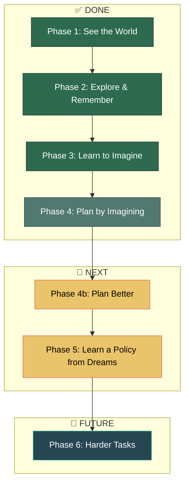
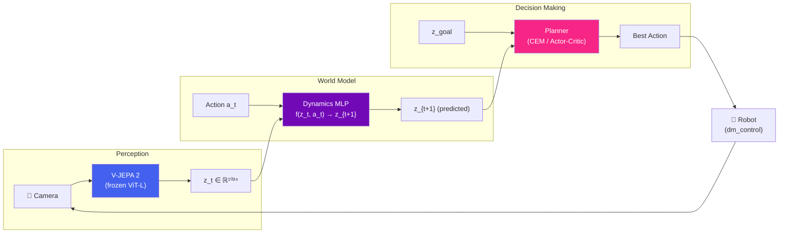

# V-JEPA 2 Robotics World Model — Roadmap

## The Big Picture

We're building a system where a robot can **imagine the future** before acting, using V-JEPA 2 as its "eyes" and a learned dynamics model as its "imagination."

---

## Phase Breakdown

### ✅ Phase 1 — See the World
> *"Can V-JEPA understand what a robot sees?"*

| | |
|---|---|
| **What we did** | Trained a behavior cloning policy on top of frozen V-JEPA 2 embeddings. A P-controller expert generates demonstrations, V-JEPA encodes frames into 1024-dim latent vectors, and an MLP policy maps those to actions. |
| **Script** | [train_bc.py](file:///home/thomas/development/experiments/Meta-s-Jepa/train_robots/train_bc.py), [eval_modal.py](file:///home/thomas/development/experiments/Meta-s-Jepa/train_robots/eval_modal.py) |
| **Outcome** | ✅ BC policy achieves ~70% success on `reacher-easy`. Proved V-JEPA embeddings carry enough spatial info for control. |
| **Limitation** | Policy is limited by expert quality — can't exceed the P-controller's performance. |

---

### ✅ Phase 2 — Explore & Remember
> *"Collect diverse experience: what happens when actions go wrong?"*

| | |
|---|---|
| **What we did** | Modified the data collection to inject 30% random actions (epsilon-greedy). Collected 100k transitions of `(z_t, action, z_{t+1})` — what the world looks like now, what action was taken, and what happened next. |
| **Script** | [generate_and_encode_modal.py](file:///home/thomas/development/experiments/Meta-s-Jepa/train_robots/generate_and_encode_modal.py) |
| **Outcome** | ✅ 496 MB dataset covering both expert and exploratory behavior. |
| **Compute** | ~$0.75 on Modal (A10G, ~40 min) |

---

### ✅ Phase 3 — Learn to Imagine
> *"Given where I am and what I do, predict where I'll be."*

| | |
|---|---|
| **What we did** | Trained a 3-layer MLP that takes `(z_t, action)` → predicts `z_{t+1}`. Uses residual prediction (`z + Δz`) so the network only needs to learn what *changes*. |
| **Script** | [train_dynamics.py](file:///home/thomas/development/experiments/Meta-s-Jepa/train_robots/train_dynamics.py) |
| **Outcome** | ✅ Validation loss ~0.01 (SmoothL1). The model learned to predict 1-step transitions in latent space. |
| **Limitation** | Errors compound over multi-step rollouts. MLP may be too simple for complex dynamics. |

---

### ✅ Phase 4 — Plan by Imagining
> *"Imagine 1000 futures, pick the best one."*

| | |
|---|---|
| **What we did** | Built a random-shooting MPC planner: sample 1000 random action sequences, unroll each 10 steps through the dynamics model, pick the sequence whose endpoint is closest to the goal. |
| **Script** | [mpc_planner.py](file:///home/thomas/development/experiments/Meta-s-Jepa/train_robots/mpc_planner.py) |
| **Outcome** | ⚠️ End-to-end pipeline runs, but achieved 0 reward. Two problems: (1) couldn't find a good goal state via random exploration, (2) random shooting is too inefficient in continuous action spaces. |

---

### 🔧 Phase 4b — Plan *Better* (Next Up)
> *"Same idea, smarter search."*

| | |
|---|---|
| **What to do** | **Fix 1:** Use the P-controller expert to generate the goal image (guaranteed high-reward state). **Fix 2:** Replace random shooting with **CEM** (Cross-Entropy Method) — iteratively refine the top-performing action sequences instead of pure random sampling. |
| **Expected outcome** | Non-zero rewards → validates that the dynamics model actually learned useful physics. |
| **Effort** | ~1-2 hours, ~30 lines of code change |

---

### 🔧 Phase 5 — Learn a Policy from Dreams
> *"Stop searching at test time. Train a fast policy on imagined rollouts."*

| | |
|---|---|
| **What to do** | Use the dynamics model to generate thousands of synthetic trajectories ("dreams"). Train an actor-critic (SAC) on these imagined rollouts — no real environment interaction needed. This is the **Dreamer / TD-MPC** approach. |
| **Expected outcome** | A policy that acts in a single forward pass (~1ms) instead of 10k forward passes per step with MPC. Should match or exceed BC performance while being more sample-efficient. |
| **Effort** | ~4-6 hours. New script + Modal GPU training. |

---

### 🚀 Phase 6 — Scale to Harder Tasks
> *"Prove this generalizes beyond a simple reaching task."*

| | |
|---|---|
| **What to do** | Apply the full pipeline to `walker-walk`, `cheetah-run`, or manipulation tasks. Potentially upgrade the MLP dynamics model to a small Transformer for sequence-aware predictions. |
| **Expected outcome** | Demonstrate that the V-JEPA world model approach transfers across tasks — the core thesis of the project. |

---

## Architecture at a Glance

